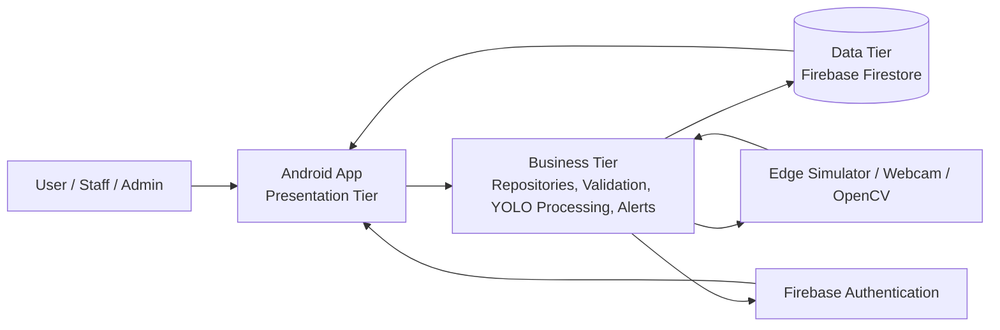
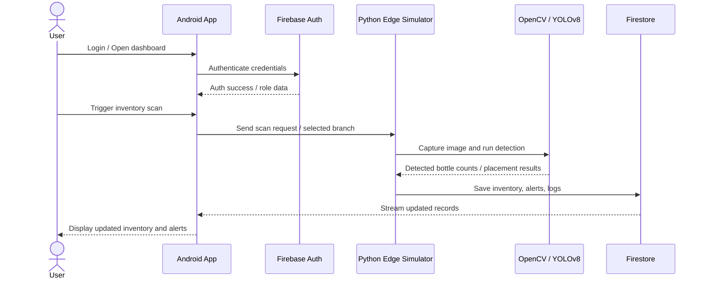
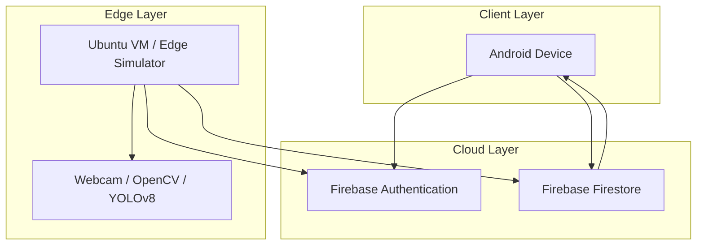

# ASIA Semestral Project Material 1
## Project Alignment Document

**Project Title:** Computer Vision-Based Smart Shelf with Mobile App Monitoring for Perfume Inventory Management  
**Subject:** IT 322 – Advanced Systems Integration and Architecture  
**Team / Proponents:** [Insert names here]  
**Institution:** Batangas State University – The National Engineering University, Lipa Campus  
**Date:** [Insert submission date]

---

## 1. Project Overview and Problem Context

### 1.1 Project Overview
This project is an enterprise-style inventory monitoring system for perfume shelves across multiple branches. It combines a mobile application, AI-based vision processing, and cloud synchronization to detect stock status, record movements, and provide real-time visibility for administrators and staff.

The current implementation, named **Otto Scents**, already uses:
- **Android application** for the presentation layer
- **Firebase Authentication** for login and role-based access
- **Firebase Firestore** for cloud data storage and synchronization
- **YOLOv8 + OpenCV** for computer vision-based detection
- **Python edge simulator** for the business/integration layer

### 1.2 Problem Statement
Manual inventory monitoring is slow and error-prone. In perfume retail operations, stock counts can change quickly due to sales, restocking, and misplaced items. Without a centralized and real-time monitoring system, the branch staff may experience:
- inaccurate stock records
- delayed restocking
- difficulty identifying misplaced items
- poor visibility across branches
- weak technical foundation for capstone defense and deployment

### 1.3 Proposed Technical Solution
The proposed solution is a **3-tier integrated system** that separates user interface, business logic, and data storage. The Android app serves as the interface for users, the Python simulator and repository logic handle processing and validation, and Firebase Firestore stores inventory, alerts, logs, and settings.

This design ensures:
- modularity and maintainability
- secure authentication
- real-time synchronization
- clear separation of concerns
- cloud-ready architecture suitable for defense and future capstone expansion

---

## 2. Visual Architectural Diagram

### 2.1 3-Tier Architecture Diagram

### 2.2 Tier Mapping

| Tier | Components | Responsibilities |
|---|---|---|
| Presentation Tier | Android app, Jetpack Compose UI | Login, dashboard, inventory views, alerts, calibration screens |
| Business Tier | `AuthRepository`, `FirestoreRepository`, Python `shelf_simulator.py`, YOLOv8 logic | Authentication handling, validation, detection, alert creation, synchronization |
| Data Tier | Firebase Firestore, user documents, inventory collections, logs, settings | Persistent storage of app data, sync state, logs, and system configuration |

### 2.3 Technology Placement

| Technology | Tier | Purpose |
|---|---|---|
| Android Jetpack Compose | Presentation | User interface and interaction |
| Firebase Auth | Business / External Service | Secure sign-in and registration |
| Firebase Firestore | Data | Cloud storage and live synchronization |
| Python | Business | Edge-side processing and integration |
| YOLOv8 | Business | Image-based perfume detection |
| OpenCV | Business / Hardware integration | Camera capture and frame processing |
| Webcam / Camera | External Hardware | Live shelf capture and calibration |

---

## 3. Integration and Interoperability Plan

### 3.1 Integration Points
The system uses the following major integration points:
1. **Firebase Authentication** – handles user login and account verification.
2. **Firebase Firestore** – stores inventory, alerts, movement logs, settings, and branch data.
3. **Webcam / Camera Input** – captures shelf images for AI analysis and calibration.
4. **YOLOv8 Computer Vision Model** – detects perfume bottles and supports stock analysis.

### 3.2 Sequence / Integration Flow

### 3.3 How Interoperability Works
- The Android app never writes directly to the database without passing through the repository/business logic layer.
- Authentication is handled through Firebase Auth to ensure secure identity management.
- Inventory updates are processed by the simulator and repository methods before being saved in Firestore.
- Camera input and AI detection are used as the physical-to-digital bridge for stock monitoring.
- Real-time Firestore streams allow the app to reflect database updates immediately.

---

## 4. High Availability and Infrastructure Strategy

### 4.1 Availability Target
**Target uptime:** 99.9% for the cloud-synchronized inventory service.

### 4.2 Deployment / Infrastructure Diagram

### 4.3 Infrastructure Strategy
- **Cloud-first storage** using Firestore prevents local-only data loss.
- **Edge processing** on the simulator or VM reduces load on the mobile device.
- **Real-time sync** ensures the app and processing layer see the same branch data.
- **Redundancy concept** can be represented in the defense as multiple branch collections and cloud persistence, reducing single-point failure risk.
- If a live integration is not available during demo, **mocked data or temporary test records** may be used, but the logical flow must remain intact.

---

## 5. Gap Analysis: Capstone vs. ASIA Requirements

### 5.1 What the Original Capstone Already Covers
- Problem context for perfume inventory management
- AI-based shelf monitoring concept
- Multi-branch operation
- Hardware-assisted monitoring design
- Android-based monitoring interface

### 5.2 What ASIA Adds
| Requirement | Gap in Original Capstone | ASIA Enhancement |
|---|---|---|
| Strict 3-tier separation | Architecture may be described conceptually, but not always defended as a full enterprise pattern | Formal separation of presentation, business, and data tiers |
| Integration evidence | Capstone may focus on functionality | Needs explicit interoperability inventory and proof screenshots |
| Cloud readiness | Original design may be more prototype-oriented | Must present a cloud-ready and defense-ready deployment strategy |
| Security | Security may be listed generally | Must show authentication, hashed credentials, and secure config handling |
| Validation | Inputs may be implied | Must prove invalid data is rejected in the business layer |
| Availability | May rely on a single environment | Must discuss HA, uptime target, and resilience strategy |
| Documentation | Chapters 1–3 describe the system | ASIA requires technical alignment, diagrams, and structured evidence |

### 5.3 Critical Technical Improvements Needed
- enforce a clear repository/business layer between UI and Firestore
- keep API keys and credentials outside source logic
- document and demonstrate both Firebase Auth and Firestore flows
- prepare evidence of folder separation and working integration logs
- present the project as a distributed, defense-ready system rather than a standalone app

---

## 6. Conclusion

The **Otto Scents** system is well aligned with the ASIA semestral project because it already combines mobile UI, cloud storage, authentication, AI processing, and edge integration. For Material 1, the key task is to present this system as a professionally structured **3-tier architecture** with a clear integration flow, deployment strategy, and gap analysis.

This document can be exported to PDF after inserting final screenshots and polishing the diagrams if needed.

---

## 7. Suggested Next Step
For the next material, prepare:
- an **ISO 25010 radar chart**
- a **conceptual data path diagram**
- a **performance scaling graph**

These will complete the ASIA logic/quality section of your submission.

